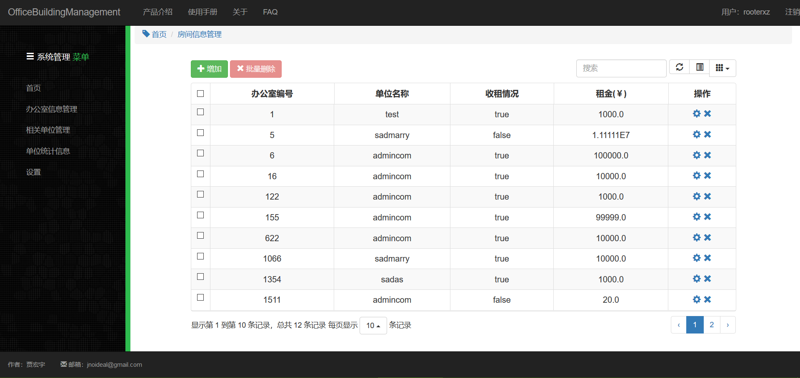
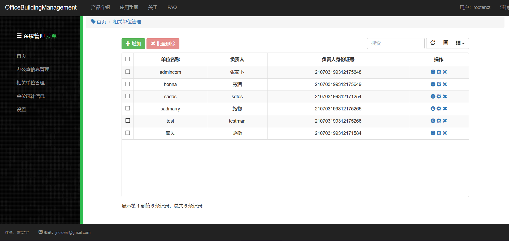
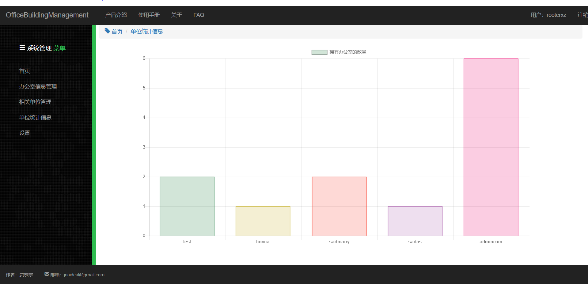

<!-- GFM-TOC -->
* [一、首页](#一首页)
* [二、系统管理员主界面](#二系统管理员主界面)
* [三、办公室信息管理](#三办公室信息管理)
* [四、相关单位管理](#四相关单位管理)
* [五、单位统计信息](#五单位统计信息)
* [流、弹出框](#流弹出框)

# 一、首页

  
 

# 二、系统管理员主界面

  
 

# 三、用户管理

  
 

# 四、相关单位管理

  
 

# 五、单位统计信息

  
 

# 六、弹出框

  
 
